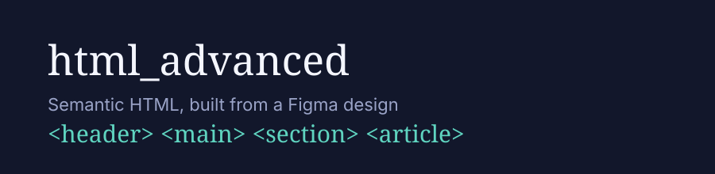

# html_advanced

## About

This project is the first step in rebuilding a full webpage from a
designer's Figma file, one piece at a time. Unlike earlier projects,
the focus here is **structure only**: no CSS, no styling, just clean,
semantic HTML that mirrors the layout and hierarchy of the design.

## Objectives

- Translate a Figma design into a valid HTML skeleton
  (`<html>`, `<head>`, `<body>`).
- Build a `<header>` containing a clickable logo and a navigation
  block of links.
- Build a `<main>` containing:
  - A **banner** `<section>` with a headline, supporting text, a call
    to action button, and a 4-item feature grid.
  - A **quote** `<section>` pairing an image with a `<blockquote>`,
    its author, and a short sub-title.
- Use the correct semantic tag for every element (headings at the
  right level, `<blockquote>` for quotes, `<button>` for actions,
  etc.) rather than generic `
`s wherever a more meaningful tag
  exists.
- Keep the markup framework-free: plain HTML, hand-written, matching
  the structure requirements exactly.

## Repo structure

| File | Description |
| --- | --- |
| `README.md` | This file |
| `index.html` | The page: header, banner section, and quote section |

## Notes

Styling (CSS) is intentionally out of scope for this project — it
will be layered on in a later project once the semantic structure is
in place.
